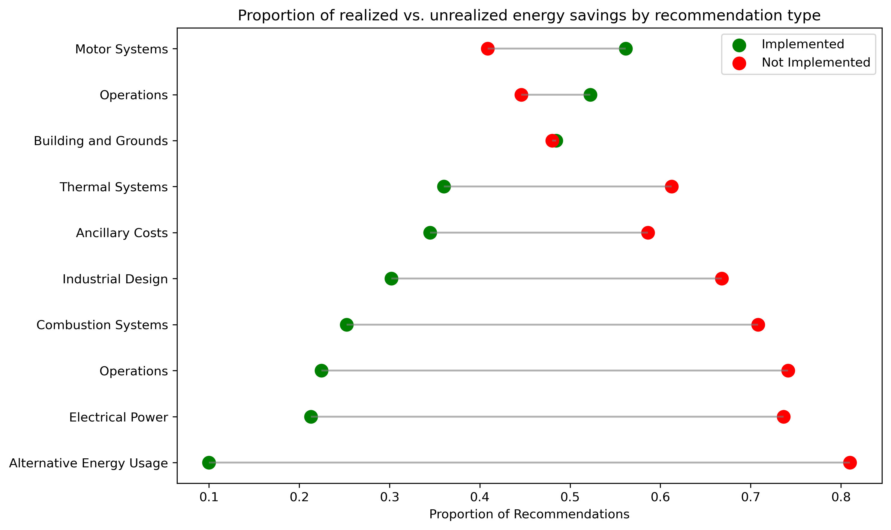

# Socio-economic equity in U.S. public EV charging network (data visualization)



### Table Of Contents

1. [Objective](#objective)
2. [Installation](#installation)
3. [File Structure](#file-structure)
4. [Data](#data)
5. [Usage](#usage)
6. [Contribute](#contribute)
7. [License](#license)

## Objective
This notebook visualizes the realized energy savings rates from Industrial Assessment Center (IAC) recommendations.

## Installation

[Back to top](#table-of-contents) <br>

**Repository**: [IAC Energy Savings Impact Assessment](https://github.com/oksanaprotsukha/iac_impact_assessment)

The analysis is written in Python and SQL. The following tools are required to rerun the analysis: <br>
- Python-ready environment (e.g. `VSCode`) <br>
- DuckDB database file <br>

## File Structure

[Back to top](#table-of-contents) <br>

```         
├── LICENSE
├── README.md
├── database
│   └── iac.duckdb
├── iac.ipynb
└── realized_vs_not_realized_energy_savings.png
```

## Data

[Back to top](#table-of-contents) <br>

The analysis is based on [Industrial Energy Assessment Database](https://iac.university/download).

## Usage

[Back to top](#table-of-contents) This repo can be used to reproduce and contribute to the analysis.

## License

[Back to top](#table-of-contents)

[MIT license](./LICENSE)

